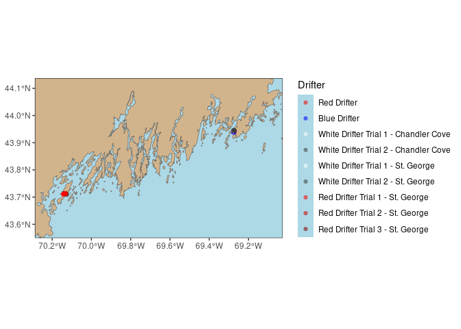
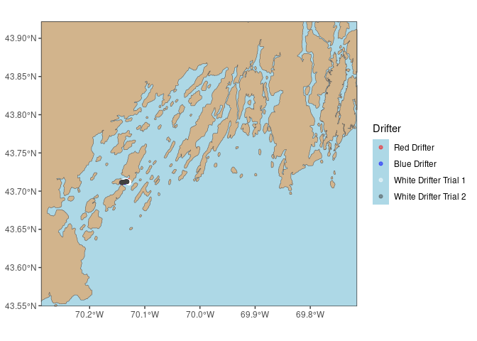
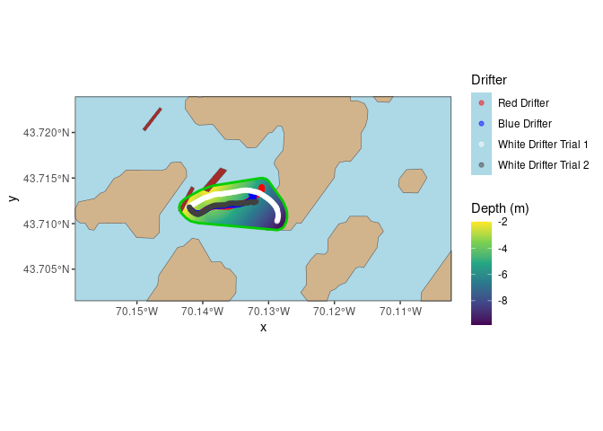
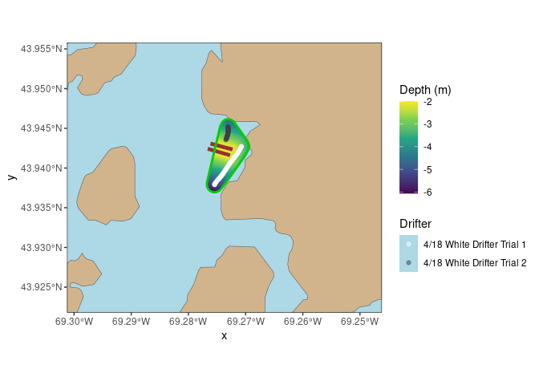
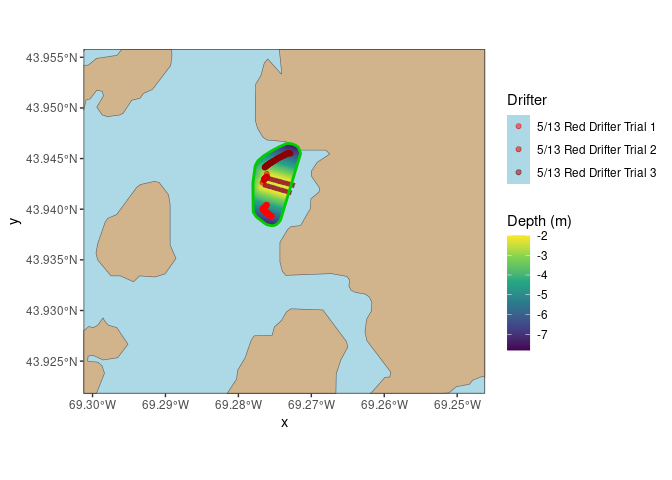

drifter
================

[drifter](https://github.com/kolive4/drifter) provide supplementary
tools for working with track data.

### Requirements

- [R v 4.1+](https://www.r-project.org/)
- [rlang](https://CRAN.R-project.org/package=rland)
- [dplyr](https://CRAN.R-project.org/package=dplyr)
- [sf](https://CRAN.R-project.org/package=sf)
- [xml2](https://CRAN.R-project.org/package=xml2)
- [readr](https://CRAN.R-project.org/package=readr)
- [lubridate](https://CRAN.R-project.org/package=lubridate)
- [purrr](https://CRAN.R-project.org/package=purrr)

### Suggested/Optional Packages

- [maree](https://github.com/BigelowLab/maree)

### Installation

``` r
remotes::install_github("kolive4/drifter")
```

    ## Downloading GitHub repo kolive4/drifter@HEAD

    ## lubridate (1.9.3 -> 1.9.4) [CRAN]
    ## xml2      (1.3.6 -> 1.3.8) [CRAN]

    ## Installing 2 packages: lubridate, xml2

    ## Installing packages into '/home/koliveira/R/x86_64-redhat-linux-gnu-library/4.5'
    ## (as 'lib' is unspecified)

    ## ── R CMD build ─────────────────────────────────────────────────────────────────
    ##      checking for file ‘/tmp/RtmpaUNm8w/remotes1613037c0bfc3/kolive4-drifter-b8ce846/DESCRIPTION’ ...  ✔  checking for file ‘/tmp/RtmpaUNm8w/remotes1613037c0bfc3/kolive4-drifter-b8ce846/DESCRIPTION’
    ##   ─  preparing ‘drifter’:
    ##    checking DESCRIPTION meta-information ...  ✔  checking DESCRIPTION meta-information
    ##   ─  checking for LF line-endings in source and make files and shell scripts
    ##   ─  checking for empty or unneeded directories
    ##    Omitted ‘LazyData’ from DESCRIPTION
    ##        NB: this package now depends on R (>= 4.1.0)
    ##        WARNING: Added dependency on R >= 4.1.0 because package code uses the
    ##      pipe |> or function shorthand \(...) syntax added in R 4.1.0.
    ##      File(s) using such syntax:
    ##        ‘TBI_drifter_plotting.R’ ‘bbox.R’ ‘csv.R’ ‘drift_functions.R’
    ##        ‘gpkg.R’ ‘gpx.R’ ‘io.R’ ‘tide2time.R’
    ## ─  building ‘drifter_0.1.0.tar.gz’
    ##      
    ## 

    ## Installing package into '/home/koliveira/R/x86_64-redhat-linux-gnu-library/4.5'
    ## (as 'lib' is unspecified)

    ## Warning in i.p(...): installation of package
    ## '/tmp/RtmpaUNm8w/file16130324d02a94/drifter_0.1.0.tar.gz' had non-zero exit
    ## status

## Usage

``` r
suppressPackageStartupMessages(
  {
    library(sf)
    library(dplyr)
    library(drifter)
  }
)

source("setup.R")
```

    ## here() starts at /mnt/ecocast/projects/koliveira/subprojects/drifter

### Reading example drift data

``` r
# drift_tibble = read_gpx("inst/ex_data/cape_cod_complicated.GPX")
drift_sf = import_gpx("inst/ex_data/cape_cod_complicated.GPX", form = "sf")

tbi_1 = import_gpx(filename = "/mnt/ecocast/projects/koliveira/subprojects/drifter/inst/ex_data/TBI_drifts/TBI_drifts_28_03_2025.GPX",
                   form = "sf") |>
  purrr::pluck("tracks") |>
  drift_speed()
tbi_2 = import_gpx(filename = "/mnt/ecocast/projects/koliveira/subprojects/drifter/inst/ex_data/TBI_drifts/TBI_drifts_18_04_2025.GPX",
                 form = "sf") |>
  purrr::pluck("tracks") |>
  drift_speed()
tbi_3 = import_gpx(filename = "/mnt/ecocast/projects/koliveira/subprojects/drifter/inst/ex_data/TBI_drifts/TBI_drifts_13_05_2025.GPX",
                   form = "sf") |>
  purrr::pluck("tracks") |>
  dplyr::filter(Name != "Red1: 13 MAY 2025") |>
  drift_speed()
tbi = dplyr::bind_rows(tbi_1, tbi_2, tbi_3)
```

### Read in and plot kelp farm plots

``` r
farms = create_kelp_farm_polygons(kelp_farms_coords)
```

### Get coast shapefile

``` r
sf::sf_use_s2(F)
```

    ## Spherical geometry (s2) switched off

``` r
coastline = sf::read_sf("/mnt/ecocast/coredata/gshhg/GSHHS_shp/f/GSHHS_f_L1.shp") |>
  sf::st_simplify()
```

    ## Warning in st_simplify.sfc(st_geometry(x), preserveTopology, dTolerance):
    ## st_simplify does not correctly simplify longitude/latitude data, dTolerance
    ## needs to be in decimal degrees

### Plotting the coastline

``` r
mecoast = get_bbox("mecoast")
sf::sf_use_s2(F)
me_coastline = coastline |>
  sf::st_crop(mecoast)
```

    ## although coordinates are longitude/latitude, st_intersection assumes that they
    ## are planar

    ## Warning: attribute variables are assumed to be spatially constant throughout
    ## all geometries

``` r
me_coast_plot = ggplot() +
  geom_sf(data = me_coastline, fill = "tan") +
  geom_sf(data = farms, fill = "yellowgreen") +
  geom_sf(data = tbi, aes(color = Name)) +
  scale_x_continuous(expand = c(0,0)) +
  scale_y_continuous(expand = c(0,0)) +
  scale_color_manual(name = "Drifter",
                     labels = c("Red Drifter",
                                "Blue Drifter",
                                "White Drifter Trial 1 - Chandler Cove",
                                "White Drifter Trial 2 - Chandler Cove",
                                "White Drifter Trial 1 - St. George",
                                "White Drifter Trial 2 - St. George",
                                "Red Drifter Trial 1 - St. George",
                                "Red Drifter Trial 2 - St. George",
                                "Red Drifter Trial 3 - St. George"),
                     values = alpha(c("red2", "blue", "white", "gray25", "white", "gray25", "red1", "red3", "red4"), 0.5)) +
  theme_bw() +
  theme(panel.grid = element_blank(),
        panel.background = element_rect(fill = "lightblue"))
me_coast_plot
```

<!-- -->

### Look a little closer in Casco Bay and Chandler Cove

``` r
casco = get_bbox("casco")
sf::sf_use_s2(F)
casco_coastline = coastline |>
  sf::st_crop(casco)
```

    ## although coordinates are longitude/latitude, st_intersection assumes that they
    ## are planar

    ## Warning: attribute variables are assumed to be spatially constant throughout
    ## all geometries

``` r
cas_farms = farms |>
  dplyr::filter(stringr::str_starts(name, "CAS"))

casco_plot = ggplot() +
  geom_sf(data = casco_coastline, fill = "tan") +
  geom_sf(data = tbi_1, aes(color = Name)) +
  scale_x_continuous(expand = c(0,0)) +
  scale_y_continuous(expand = c(0,0)) +
  scale_color_manual(name = "Drifter",
                     labels = c("Red Drifter",
                                "Blue Drifter",
                                "White Drifter Trial 1",
                                "White Drifter Trial 2"
                                ),
                     values = alpha(c("red", "blue", "white", "gray25"), 0.5)) +
  theme_bw() +
  theme(panel.grid = element_blank(),
        panel.background = element_rect(fill = "lightblue"))
casco_plot
```

<!-- -->

### Chandler Cove

``` r
chcv = get_bbox("chcv")
sf::sf_use_s2(F)
chcv_coastline = coastline |>
  sf::st_crop(chcv)
```

    ## although coordinates are longitude/latitude, st_intersection assumes that they
    ## are planar

    ## Warning: attribute variables are assumed to be spatially constant throughout
    ## all geometries

``` r
tbi_1_area = drift_area(tbi_1, 100) 
```

    ## although coordinates are longitude/latitude, st_union assumes that they are
    ## planar

    ## Spherical geometry (s2) switched on

``` r
tbi_1_pd = particle_depth(area = tbi_1_area,
                          sink_rate = 0.002,
                          start_depth = 2,
                          max_depth = 13,
                          farms = cas_farms)
```

    ## Warning: attribute variables are assumed to be spatially constant throughout
    ## all geometries

``` r
chcv_area_plot = ggplot() +
  geom_sf(data = chcv_coastline, fill = "tan") +
  geom_stars(data = tbi_1_pd) +
  scale_fill_viridis_c(name = "Depth (m)", na.value = NA) +
  geom_sf(data = farms |>
            dplyr::filter(stringr::str_starts(name, "CAS")), fill = "brown") +
  geom_sf(data = tbi_1_area, fill = NA, color = "green3", linewidth = 1) +
  geom_sf(data = tbi_1, aes(color = Name)) +
  scale_x_continuous(expand = c(0,0)) +
  scale_y_continuous(expand = c(0,0)) +
  scale_color_manual(name = "Drifter",
                     labels = c("Red Drifter",
                                "Blue Drifter",
                                "White Drifter Trial 1",
                                "White Drifter Trial 2"
                                ),
                     values = alpha(c("red", "blue", "white", "gray25"), 0.5)) +
  theme_bw() +
  theme(panel.grid = element_blank(),
        panel.background = element_rect(fill = "lightblue"))
chcv_area_plot
```

    ## Warning: Removed 252693 rows containing missing values or values outside the scale range
    ## (`geom_raster()`).

<!-- -->

### Look a little closer at Deep Cove

``` r
stgeo = get_bbox("stgeo")
sf::sf_use_s2(F)
```

    ## Spherical geometry (s2) switched off

``` r
stgeo_coastline = coastline |>
  sf::st_crop(stgeo)
```

    ## although coordinates are longitude/latitude, st_intersection assumes that they
    ## are planar

    ## Warning: attribute variables are assumed to be spatially constant throughout
    ## all geometries

``` r
stgeo_farms = farms |>
  dplyr::filter(stringr::str_starts(name, "STG"))

tbi_2_area = drift_area(tbi_2, 100)
```

    ## although coordinates are longitude/latitude, st_union assumes that they are
    ## planar

    ## Spherical geometry (s2) switched on

``` r
tbi_2_pd = particle_depth(area = tbi_2_area,
                          sink_rate = 0.002,
                          start_depth = 2,
                          max_depth = 13,
                          farms = stgeo_farms)
```

    ## Warning: attribute variables are assumed to be spatially constant throughout
    ## all geometries

``` r
stgeo_area_plot = ggplot() +
  geom_sf(data = stgeo_coastline, fill = "tan") +
  geom_stars(data = tbi_2_pd) +
  scale_fill_viridis_c(name = "Depth (m)", na.value = NA) +
  geom_sf(data = farms |>
            dplyr::filter(stringr::str_starts(name, "STG")), fill = "brown") +
  geom_sf(data = tbi_2_area, fill = NA, color = "green3", linewidth = 1) +
  geom_sf(data = tbi_2, aes(color = Name)) +
  scale_x_continuous(expand = c(0,0)) +
  scale_y_continuous(expand = c(0,0)) +
  scale_color_manual(name = "Drifter",
                     labels = c("4/18 White Drifter Trial 1",
                                "4/18 White Drifter Trial 2"
                                ),
                     values = alpha(c("white", "gray25"), 0.5)) +
  theme_bw() +
  theme(panel.grid = element_blank(),
        panel.background = element_rect(fill = "lightblue"))
stgeo_area_plot
```

    ## Warning: Removed 267860 rows containing missing values or values outside the scale range
    ## (`geom_raster()`).

<!-- -->

### Look a little closer at Deep Cove round 2

``` r
tbi_3_area = drift_area(tbi_3, 100)

tbi_3_pd = particle_depth(area = tbi_3_area,
                          sink_rate = 0.002,
                          start_depth = 2,
                          max_depth = 13,
                          farms = stgeo_farms)
```

    ## Warning: attribute variables are assumed to be spatially constant throughout
    ## all geometries

``` r
stgeo2_area_plot = ggplot() +
  geom_sf(data = stgeo_coastline, fill = "tan") +
  geom_stars(data = tbi_3_pd) +
  scale_fill_viridis_c(name = "Depth (m)", na.value = NA) +
  geom_sf(data = stgeo_farms, fill = "brown") +
  geom_sf(data = tbi_3_area, fill = NA, color = "green3", linewidth = 1) +
  geom_sf(data = tbi_3, aes(color = Name)) +
  scale_x_continuous(expand = c(0,0)) +
  scale_y_continuous(expand = c(0,0)) +
  scale_color_manual(name = "Drifter",
                     labels = c("5/13 Red Drifter Trial 1",
                                "5/13 Red Drifter Trial 2",
                                "5/13 Red Drifter Trial 3"
                                ),
                     values = alpha(c("red1", "red3", "red4"), 0.5)) +
  theme_bw() +
  theme(panel.grid = element_blank(),
        panel.background = element_rect(fill = "lightblue"))
stgeo2_area_plot
```

    ## Warning: Removed 154463 rows containing missing values or values outside the scale range
    ## (`geom_raster()`).

<!-- -->
