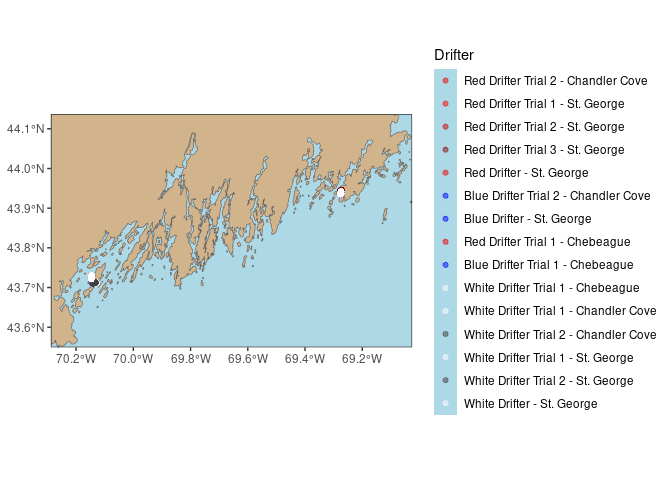

drifter
================

[drifter](https://github.com/kolive4/drifter) provide supplementary
tools for working with track data.

### Requirements

- [R v 4.1+](https://www.r-project.org/)
- [rlang](https://CRAN.R-project.org/package=rland)
- [dplyr](https://CRAN.R-project.org/package=dplyr)
- [sf](https://CRAN.R-project.org/package=sf)
- [xml2](https://CRAN.R-project.org/package=xml2)
- [readr](https://CRAN.R-project.org/package=readr)
- [lubridate](https://CRAN.R-project.org/package=lubridate)
- [purrr](https://CRAN.R-project.org/package=purrr)

### Suggested/Optional Packages

- [maree](https://github.com/BigelowLab/maree)

### Installation

    remotes::install_github("kolive4/drifter")

## Usage

### Reading drift data

``` r
tbi_1 = import_gpx(filename = "/mnt/ecocast/projects/koliveira/subprojects/drifter/inst/ex_data/TBI_drifts/TBI_drifts_28_03_2025.GPX",
                   form = "sf") |>
  purrr::pluck("tracks") |>
  drift_speed()

tbi_2 = import_gpx(filename = "/mnt/ecocast/projects/koliveira/subprojects/drifter/inst/ex_data/TBI_drifts/TBI_drifts_18_04_2025.GPX",
                 form = "sf") |>
  purrr::pluck("tracks") |>
  drift_speed()

tbi_3 = import_gpx(filename = "/mnt/ecocast/projects/koliveira/subprojects/drifter/inst/ex_data/TBI_drifts/TBI_drifts_13_05_2025.GPX",
                   form = "sf") |>
  purrr::pluck("tracks") |>
  dplyr::filter(Name != "Red1: 13 MAY 2025") |>
  drift_speed()

tbi = dplyr::bind_rows(tbi_1, tbi_2, tbi_3)
```

### Read in kelp farm plots

``` r
farms = create_kelp_farm_polygons()
```

### Get coast shapefile

``` r
sf::sf_use_s2(F)
coastline = sf::read_sf("/mnt/ecocast/coredata/gshhg/GSHHS_shp/f/GSHHS_f_L1.shp") |>
  sf::st_simplify()
```

### Plotting the coastline

All drifts conducted as a part of this project are plotted in this
figure. Though they may be too small to see in their entirety, this
figure shows the two locales where we focused our study.
<!-- -->

## Plot explanations

The following figures show close ups of Chandler Cove, Casco Bay, Maine,
USA, and Deep Cove, St. George River, Maine, USA. Kelp farm footprints
are plotted in brown. All drifts conducted in this trial are represented
by colored lines. A 100 m buffer around the drifts was created and then
a convex hull wrapped around the buffers to create an area of interest.
The depth at which a particle from the kelp farm would be corresponds to
the fill color of the area of interest polygon.

This particle depth gradient is aimed at providing a rough estimate of
where kelp particles might be in the water column at a given distance
away from the kelp farms. The depth gradient is calculated based on the
average drift speed, direction, and a constant sinking rate of 0.002
m/s. We recognize that the sinking rate might change as a particle
crosses depth layers, but we use this to guide sampling efforts moving
forward.

### Chandler Cove 28-March-2025

<!-- -->

### Deep Cove 18-April-2025

<!-- -->

### Deep Cove 13-May-2025

<!-- -->
